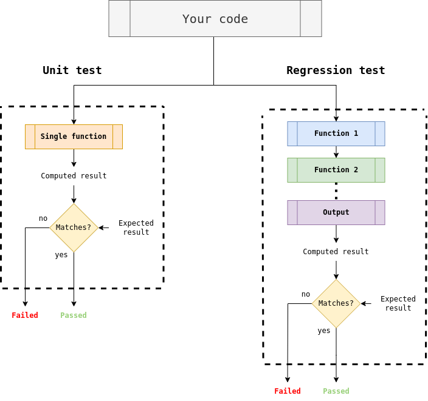

Continuous-Integration, Continuous-Development
==============================================

In collaborative development, it is very easy for things to break if your code is not tested. In order to ensure new features do not interfere with the rest of the code, regression and unit tests are necessary.

 This repository contains some guidelines on how to set up your own automated regression workflow and using GitHub Actions to run your code on a virtual machine.

# Step 1: Define regression and unit tests

The first step in setting up a sustainable and maintainable code environment is to define a set of regression and unit tests that demonstrate key features of your code. 

*Unit tests* are used to test the functionality of smaller parts of the code and are typically limited to single functions. 

*Regression tests* evaluate the functionality of the full program. An example for a regression test may be using your code to run a pre-existing test case and checking whether the result matches the expectation. 

The exact content of the unit and regression tests depends on the code and application. The one thing they should do is to run a pre-defined computation that has an expected result. The test is passed if the computed result matches the expected result. The two tests are visualized below. A unit test will test a small part, usually a single function. A regression test will test the output from a full workflow of your code.

It is recommended to keep the regression and especially unit tests as computationally light as possible. That way, you can test many parts of your code without waiting too long for the test results. 

An example of a regression test workflow can be found [here](run_regression.py). Currently, this workflow contains only one test case. In this [regression test](../testcases/testcase_1/train_simple_MLP.py), a multi-layer perceptron is trained on some labeled data. The output from the trained network is then compared to a set of [reference data](../testcases/testcase_1/test_data_ref.csv). If the predicted data matches the reference data, the test is passed. 

T
You can define your own test case using the [template function](TestCase.py), which compares the content of two files (reference and output). 

After defining your unit tests and regression tests, you can run the [workflow file](run_regression.py) in order to test your code integrity. 

# Step 2: GitHub Actions
After completing step 1, you can now locally test the integrity of your code. If you work on your own or only with a few people, this may be sufficient to prevent things from breaking. However, if your team is large and you want to ensure the functionality of your code, you may want to take it a step further. For this, you can use GitHub Actions.

GitHub Actions enables the use of scripted actions when pushing changes to your repository. For example, running a set of regression tests when opening a pull request. 

step 1: install docker, create acount
step 2: docker.com -> account settings -> personal access tokens -> generate new token -> give name, read,write,delete permission -> generate, copy to password manager!
step 3: github repository page->repository settings->security:secrets and variables->actions
Define Variable:
Variables->new repository variable:
Name: DOCKERHUB_USERNAME
Value: your docker ID

Define secret:
Secrets->new repository secret:
Name: DOCKERHUB_TOKEN
Value: your docker token from step 2

step 4: github repository page->repository settings->code and automation:Actions->General->Workflow permissions->Read and write permissions

step 5: 
